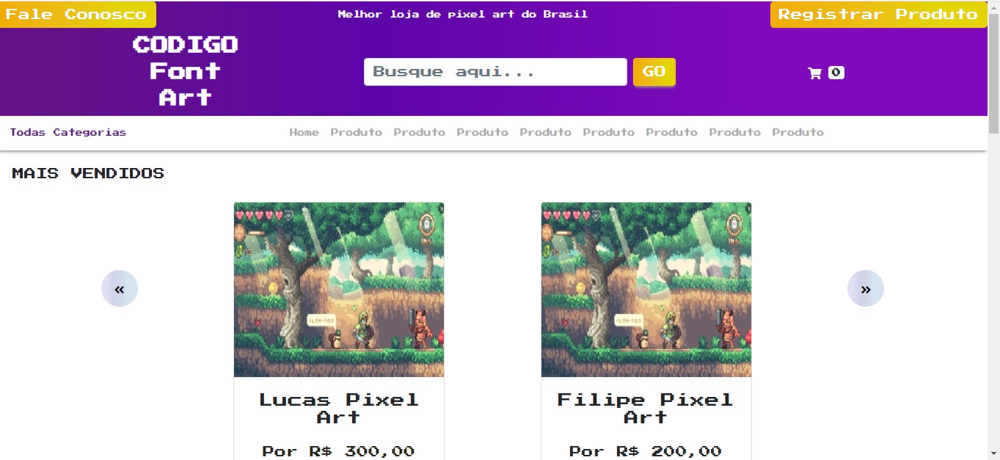
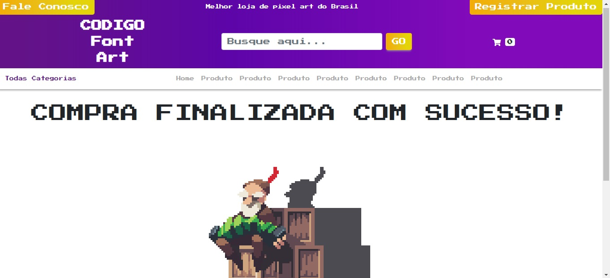

Esse projeto foi criado por Samuel Silva Costa Nascimento

## CodigoFontArt Site

## ✦ Telas
<h1 align="center">
    
    
    
    
    
    
    
    
</h1>

## ✦ Projeto
 

O Site CodigoFontArt foi produzido como teste para o processo seletivo da empresa CodigoFont, com o intuito de demonstrar meu conhecimento em relação ao desenvolvimento full stack!

## ✦ Tecnologias
 

Esse projeto foi desenvolvido com as seguintes tecnologias:

**Software:**
- [MongoDB](https://www.mongodb.com/)
- [React](https://pt-br.reactjs.org/)
- [Node](https://nodejs.org/en/)

## ✦ Iniciar o Site

Dentro do diretorio do projeto você deve rodar o seguinte comando:

### `npm start`

Abra [http://localhost:3000](http://localhost:3000) para realizar a vizualição no browser.
Se o banco de dados + o back-end não estiver rodando, o site irá rodar apenas com as informações presentes no front-end.
